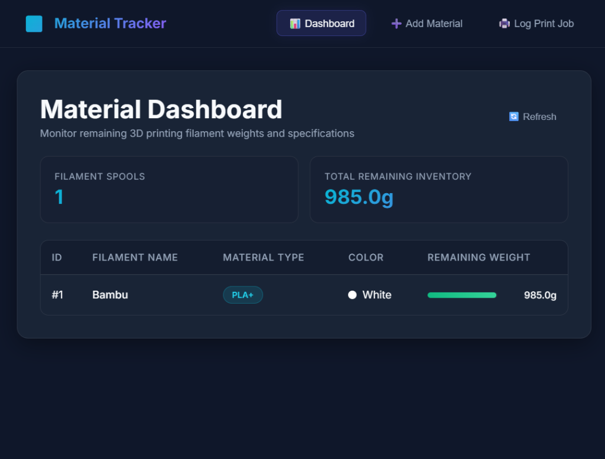

# 🎛️ 3D Printing Material Tracker

A modern full-stack web application designed to track 3D printer filament spools, manage printing jobs, and automatically calculate remaining material inventory weight with live progress gauges.



## 🚀 Features

- **📊 Live Spool Inventory**: Real-time overview of all active filament spools (PLA+, TPU, PETG, etc.), remaining weights, and visual warning gauges when levels get low.
- **🖨️ Automated Logging**: Automatically logs 3D print actions and deducts the filament weight consumed from the associated spool.
- **🔒 Transactional Integrity**: Database rollback prevents spools from dropping below `0g` remaining weight, returning clear validation constraints.
- **🎨 Premium Dark Theme**: Custom glassmorphism responsive user interface built using vanilla CSS variables, animations, and clean layouts.
- **🗄️ In-Memory Database**: Utilizes an H2 database for rapid offline development, fully inspectable with a built-in console.

---

## 🛠️ Architecture & Tech Stack

### Backend
- **Framework**: Spring Boot 3.3 (Java 17)
- **Database**: H2 (In-Memory)
- **ORM / Persistence**: Spring Data JPA & Hibernate
- **Validation**: Jakarta Bean Validation (`spring-boot-starter-validation`)

### Frontend
- **Framework**: React (Vite, JavaScript)
- **State & Sync**: Functional components with React Hooks (`useState`, `useEffect`) and Native Fetch API
- **Styling**: Modern Custom Vanilla CSS

---

## 🗂️ Project Structure

```text
spring-boot-h2-demo/
├── pom.xml
├── README.md
├── dashboard_view.png        # Dashboard preview screenshot
├── src/                      # Backend Sources (Spring Boot)
│   ├── main/
│   │   ├── java/com/example/demo/
│   │   │   ├── controller/   # REST Controllers (CORS enabled)
│   │   │   ├── dto/          # Data Transfer Objects
│   │   │   ├── exception/    # Custom Exceptions & Global REST Handlers
│   │   │   ├── model/        # JPA Entities (Material, PrintJob)
│   │   │   ├── repository/   # JpaRepository Interfaces
│   │   │   └── service/      # Business logic and Transactions
│   │   └── resources/
│   │       └── application.properties
│   └── test/                 # Service & Transaction Integration Tests
└── frontend/                 # Frontend Sources (React + Vite)
    ├── package.json
    ├── vite.config.js
    └── src/
        ├── App.jsx           # Root layout & view coordinator
        ├── index.css         # Theme stylesheet and design system tokens
        └── components/       # Dashboard, Spool and Logger Forms
```

---

## 📡 API Endpoints

### Materials
* **GET `/api/materials`**: Retrieve list of all spools.
* **POST `/api/materials`**: Add a new spool to the database.
  - Body: `{ "name": "Overture PLA White", "type": "PLA+", "color": "White", "remainingWeightGrams": 1000.0 }`

### Print Jobs
* **POST `/api/print-jobs`**: Create a print job and automatically deduct weight.
  - Body: `{ "printName": "Benchie", "weightUsedGrams": 15.0, "printDurationMinutes": 45, "status": "COMPLETED", "materialId": 1 }`
  - *Returns HTTP 400 Bad Request if the spool weight drops below 0g.*

---

## ⚙️ Setup and Running Instructions

### Prerequisites
- JDK 17 or higher
- Maven 3.6 or higher
- Node.js (v18+) and npm

### Step 1: Run the Spring Boot Backend
From the root folder of the project, start the backend:
```bash
mvn spring-boot:run
```
- **Web App API**: `http://localhost:8080`
- **H2 Console URL**: [http://localhost:8080/h2-console](http://localhost:8080/h2-console)
  - JDBC URL: `jdbc:h2:mem:testdb`
  - Username: `sa`
  - Password: `password`

### Step 2: Run the React Frontend Client
From the `frontend` folder, start the development server:
```bash
cd frontend
npm install
npm run dev
```
- **Frontend URL**: [http://localhost:5173](http://localhost:5173)

---

## 🧪 Testing

To run the backend integration tests verifying transactional rollback and boundary rules:
```bash
mvn test
```
